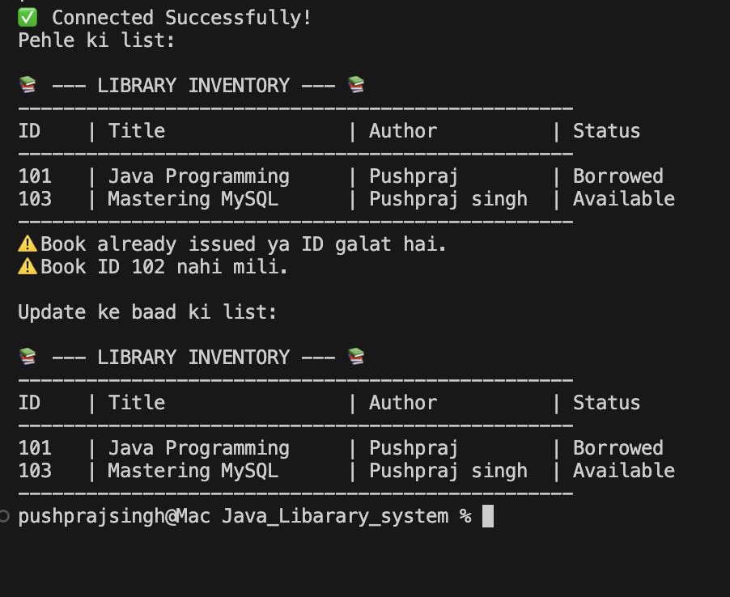

# 📚 Library Management System (Java + MySQL)

A professional command-line application to manage library books, integrated with a MySQL database for permanent data storage.

## ✨ Features
- **Full CRUD Operations:** Add, View, Issue, and Delete books.
- **Database Persistence:** Uses MySQL to ensure data is saved even after the program closes.
- **Security:** Implemented Environment Variables to hide database credentials.
- **Formatted UI:** Clean table-style output in the terminal.

## 🛠️ Tech Stack
- **Language:** Java (JDK 25)
- **Database:** MySQL
- **Driver:** MySQL Connector/J

## 🚀 How to Run
1. **Database Setup:** - Create a database named `library_db` in MySQL.
   - Run the SQL script to create the `books` table.
2. **Environment Variable:** - Set `DB_PASSWORD` in your system's environment variables.
3. **Compile & Run:**
   - Open in VS Code.
   - Add the MySQL Connector `.jar` to Referenced Libraries.
   - Run `DatabaseHandler.java`.

## 📸 Screenshots
*